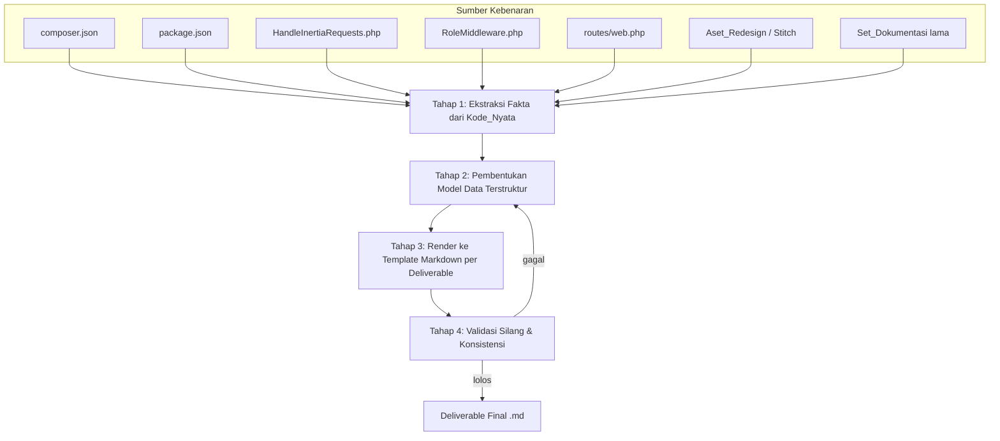

# Design Document

## Overview

Fitur **react-inertia-redesign** adalah sebuah **sistem penghasil dokumentasi (documentation-generation system)**, bukan sistem perangkat lunak konvensional. "System" yang menjadi subjek pada requirements (disebut `Sistem_Dokumentasi`) adalah sekumpulan deliverable berformat Markdown yang merencanakan migrasi lapisan presentasi BelajarKUY dari Blade + Alpine.js menjadi React.js via Inertia.js, sekaligus menyelaraskan dokumentasi terhadap kondisi kode nyata dan redesign visual Google Stitch.

Karena itu, dokumen desain ini **tidak** mendeskripsikan arsitektur runtime (tidak ada controller, service, atau endpoint baru). Sebaliknya, desain ini mendefinisikan:

1. **Struktur dan lokasi** setiap berkas Markdown yang dihasilkan.
2. **Template dan kontrak konten (content contract)** untuk masing-masing deliverable, diturunkan langsung dari acceptance criteria.
3. **Model data terstruktur** yang menjadi tulang punggung tabel/daftar di dalam dokumen (mis. entri rencana update, entri pemetaan layar, entri risiko).
4. **Pipeline penyusunan dan validasi** yang menjamin akurasi terhadap `Kode_Nyata` sebagai sumber kebenaran.
5. **Strategi penelusuran (traceability)** dari setiap acceptance criteria ke bagian dokumen yang memenuhinya.

### Deliverable yang Dihasilkan

| ID | Deliverable | Berkas | Requirement utama |
|----|-------------|--------|-------------------|
| D1 | `Master_Plan` | `BelajarKUY_docs/04_plans/MASTER_PLAN_REACT_INERTIA.md` | R1, R7 |
| D2 | `Dok_Keunggulan` | `BelajarKUY_docs/02_architecture/REACT_INERTIA_BENEFITS.md` | R2 |
| D3 | `Rencana_Update_Dok` | `BelajarKUY_docs/04_plans/DOCS_UPDATE_PLAN_REACT_INERTIA.md` | R3, R6, R8 |
| D4 | `Peta_Layar` | `BelajarKUY_docs/04_plans/SCREEN_MAPPING_STITCH_REACT.md` | R4 |
| D5 | `ADR_Baru` | `BelajarKUY_docs/02_architecture/ADR/ADR-008-frontend-react-inertia.md` | R5 |
| D6 | Pembaruan `ADR-002` (field Status) | `.../ADR/ADR-002-frontend-blade-not-livewire.md` | R5 |
| D7 | Pembaruan `ADR/README.md` (indeks) | `.../ADR/README.md` | R5 |

> Catatan: D6 dan D7 adalah **pembaruan terbatas** pada berkas dokumentasi yang sudah ada (hanya field Status dan baris indeks), bukan pembuatan berkas baru, dan tetap berada dalam scope "hanya Markdown".

### Sumber Kebenaran (Source of Truth) — Terverifikasi dari Kode

Seluruh klaim teknis dalam deliverable diturunkan dari pembacaan langsung berikut (bukan dari dokumen lama):

- **`composer.json`** (`BelajarKUY/BelajarKUY/composer.json`): `php ^8.3`, `laravel/framework ^13.7`, `inertiajs/inertia-laravel ^3.1`, `laravel/breeze ^2.4`, `laravel/socialite ^5.27`, `laravel/scout ^11.1`, `laravel/reverb ^1.10`, `meilisearch/meilisearch-php ^1.16`, `midtrans/midtrans-php ^2.6`, `cloudinary/cloudinary_php ^3.1`, `intervention/image ^4.0`, `laravel/tinker ^3.0`. **Tidak ada Filament** pada `require`.
- **`package.json`** (`BelajarKUY/BelajarKUY/package.json`): `react ^19.2.6`, `react-dom ^19.2.6`, `@inertiajs/react ^3.3.0`, `@vitejs/plugin-react ^6.0.2`, `@headlessui/react ^2.2.10`, `lucide-react ^1.17.0`, `axios ^1.16.0`, `laravel-echo ^2.3.4`, `pusher-js ^8.5.0`, `sweetalert2 ^11.26.24`; devDependencies termasuk `tailwindcss ^3.1.0`, `@tailwindcss/vite ^4.0.0`, `alpinejs ^3.15.12`, `laravel-vite-plugin ^3.1`, `vite ^8.0.0`.
- **`app/Http/Middleware/HandleInertiaRequests.php`**: `rootView = 'app'`, membagikan prop `auth.user` (`id`, `name`, `email`, `role`, `photo`, `email_verified_at`) dan `flash` (`success`, `error`, `info`, `warning`).
- **`app/Http/Middleware/RoleMiddleware.php`**: enum peran `admin`, `instructor`, dan default `user` (Student); redirect ke `admin.dashboard`, `instructor.dashboard`, atau `dashboard`.
- **`routes/web.php`**: route nyata (mis. `dashboard`, `profile.edit`, `admin.*`, `instructor.dashboard`, `student.*`, `home`, `course.detail`, `cart.index`, `checkout`, `payment.success`, `payment.failed`, `auth.google`).

> **Catatan konsistensi versi (penting untuk R8.1):** `package.json` Kode_Nyata memuat `tailwindcss ^3.1.0` pada `devDependencies` (bukan v4), meskipun terdapat juga paket `@tailwindcss/vite ^4.0.0`. Dokumen yang dihasilkan WAJIB mengutip nilai ini apa adanya, karakter-demi-karakter, dan tidak boleh "membulatkan" menjadi v4. Ketidaksesuaian dengan dokumen lama (yang menyebut Tailwind v4) dicatat sebagai koreksi pada `Rencana_Update_Dok`.

## Architecture

### Model Konseptual: Pipeline Penyusunan Dokumen

Karena deliverable bersifat statis (Markdown), "arsitektur" di sini adalah **pipeline penyusunan** berbasis empat tahap. Tahap-tahap ini bersifat konseptual (dilakukan oleh agen/penulis), bukan kode yang dieksekusi.



**Tahap 1 — Ekstraksi Fakta.** Membaca `Kode_Nyata` dan `Aset_Redesign`, menghasilkan kumpulan "fakta terverifikasi" (versi dependensi, nama route, prop Inertia, daftar folder layar). Fakta inilah satu-satunya sumber nilai yang boleh dikutip; dokumen lama hanya menjadi objek yang diperiksa, bukan sumber nilai.

**Tahap 2 — Model Data Terstruktur.** Mengubah fakta menjadi struktur (lihat bagian Data Models): registry pembaruan dokumen, daftar entri pemetaan layar, daftar risiko, daftar fase, dll. Tahap ini memastikan kelengkapan (mis. setiap berkas `Set_Dokumentasi` tercakup tepat sekali).

**Tahap 3 — Render Template.** Menuangkan model data ke template Markdown spesifik per deliverable (lihat Components and Interfaces).

**Tahap 4 — Validasi Silang.** Menjalankan daftar periksa konsistensi (lihat Testing Strategy) untuk memastikan tidak ada kontradiksi antar dokumen dan akurasi terhadap kode.

### Struktur Direktori Keluaran

```text
BelajarKUY_docs/
├── 00_INDEX.md                       (Update — R6.7)
├── CHANGELOG.md                      (Update — R6.8)
├── 02_architecture/
│   ├── TECH_STACK.md                 (Update — R6.1)
│   ├── FOLDER_STRUCTURE.md           (Update — R6.3)
│   ├── REACT_INERTIA_BENEFITS.md     (New  — D2/R2)
│   └── ADR/
│       ├── README.md                 (Update — R5.5)
│       ├── ADR-002-...md             (Update field Status — R5.4)
│       └── ADR-008-frontend-react-inertia.md  (New — D5/R5)
├── 01_guides/
│   ├── SETUP_GUIDE.md                (Update — R6.2)
│   ├── UI_UX_GUIDELINES.md           (Update — R6.4)
│   └── ...
├── 04_plans/
│   ├── MASTER_PLAN_REACT_INERTIA.md  (New — D1/R1)
│   ├── DOCS_UPDATE_PLAN_REACT_INERTIA.md (New — D3/R3)
│   ├── SCREEN_MAPPING_STITCH_REACT.md    (New — D4/R4)
│   ├── MASTER_ROADMAP.md             (Update — R6.6)
│   └── SPRINT_PLAN.md                (Update — R6.6)
└── 05_prompts/
    ├── PROMPT_SETUP_PROJECT.md       (Update — R6.5)
    └── PROMPT_FRONTEND.md            (Update — R6.5)
```

### Keputusan Desain dan Rasionalnya

| # | Keputusan | Rasional | Requirement terkait |
|---|-----------|----------|---------------------|
| DD1 | Deliverable D1, D3, D4 ditempatkan di `04_plans/`; D2 dan D5 di `02_architecture/` | Konsisten dengan konvensi kategori folder dokumentasi yang ada (`04_plans/` = perencanaan, `02_architecture/` = arsitektur/ADR) | R5.1 |
| DD2 | Penomoran ADR baru = `ADR-008` | Nomor urut berikutnya setelah `ADR-007` (terverifikasi: `ADR-001`..`ADR-007` ada di `02_architecture/ADR/`) | R5.1 |
| DD3 | Pembaruan `ADR-002` hanya pada field `Status`, sisi konten lain dibekukan | ADR bersifat immutable (lihat catatan di `ADR/README.md`); supersede dilakukan via field status + ADR baru | R5.4 |
| DD4 | `Rencana_Update_Dok` memakai satu tabel registry tunggal sebagai sumber kelengkapan | Menjamin setiap berkas/folder `Set_Dokumentasi` muncul tepat satu kali | R3.2 |
| DD5 | Semua nilai versi dikutip verbatim dari `composer.json`/`package.json` | Memenuhi pencocokan karakter-demi-karakter | R8.1 |
| DD6 | "Layar" hanya folder yang memuat `code.html` DAN `screen.png` | Definisi formal pada R4.1; folder seperti `rocket_growth_modern/` (hanya `DESIGN.md`) dan folder `*.jpeg/` (hanya `screen.png`) bukan layar | R4.1 |

## Components and Interfaces

Setiap "komponen" di sini adalah satu deliverable Markdown dengan **kontrak konten** (daftar bagian wajib yang memetakan ke acceptance criteria). Kontrak ini berperan seperti "interface": apa pun gaya penulisannya, bagian-bagian wajib HARUS ada agar requirement terpenuhi.

### C1 — `Master_Plan` (`MASTER_PLAN_REACT_INERTIA.md`) — R1, R7

Bagian wajib:

1. **Judul & Metadata** — judul, tanggal, pemilik.
2. **Scope Statement** — pernyataan eksplisit bahwa migrasi hanya menyentuh lapisan presentasi (view) dan **mengecualikan** `Lapisan_Backend`. (R1.2)
3. **Pernyataan Pelestarian Backend** — pernyataan eksplisit bahwa nama model, route, controller, skema database, dan middleware peran dipertahankan utuh tanpa perubahan. (R7.7)
4. **Baseline Scaffolding** — dokumentasi kondisi awal React+Inertia berdasarkan `composer.json`, `package.json`, dan `HandleInertiaRequests.php` (kutip `inertiajs/inertia-laravel ^3.1`, `@inertiajs/react ^3.3.0`, `react ^19.2.6`, `rootView = 'app'`, prop `auth.user` & `flash`). (R1.6)
5. **Phased Approach** — minimal **tiga fase berurutan**. Setiap fase memuat: `nama fase`, `tujuan`, `daftar view/halaman Blade yang dicakup`, dan minimal satu `exit criteria` yang dirumuskan sebagai kondisi terukur (lihat format pada Data Models — `Phase`). (R1.3)
6. **Deactivation Sequence** — urutan penonaktifan lapisan Blade per fase, terlepas dari kebutuhan koeksistensi. (R1.7)
7. **Coexistence Strategy** — WHERE koeksistensi diperlukan, jelaskan mekanisme menjalankan Blade & React bersamaan (mis. sebagian route me-render view Blade lama, sebagian me-render `Inertia::render(...)` di bawah `rootView 'app'`). (R1.8)
8. **Risk Register** — minimal **lima risiko**, masing-masing dengan `dampak` & `kemungkinan` skala {Rendah, Sedang, Tinggi} dan minimal satu mitigasi. (R1.4)
9. **Rollback Strategy** — per fase: `kondisi pemicu` + `langkah berurutan` untuk kembali ke Blade. (R1.5)
10. **Catatan Out-of-Scope** — setiap usulan yang menyiratkan perubahan `Lapisan_Backend` ditandai eksplisit sebagai rekomendasi pekerjaan terpisah. (R7.6)

### C2 — `Dok_Keunggulan` (`REACT_INERTIA_BENEFITS.md`) — R2

Bagian wajib:

1. **Pengantar manfaat** untuk BelajarKUY. (R2.1)
2. **Lima aspek**, masing-masing dengan minimal satu manfaat konkret: (a) developer experience, (b) reusabilitas komponen, (c) UX gaya SPA, (d) ekosistem React, (e) keselarasan dengan `Aset_Redesign`. (R2.2)
3. **Pengaitan klaim teknis ke kode** — minimal satu klaim teknis dengan rujukan konkret ke `Kode_Nyata` (mis. prop bersama `auth.user`/`flash` pada `HandleInertiaRequests.php`, `@inertiajs/react ^3.3.0` pada `package.json`, atau `@headlessui/react`/`lucide-react` untuk komponen UI). (R2.3, R2.4)
4. **Trade-off** — minimal **dua** konsekuensi negatif (mis. kurva belajar React untuk tim, ukuran bundel JS/hidrasi, kompleksitas SSR/SEO) masing-masing dengan mitigasi. (R2.5)

### C3 — `Rencana_Update_Dok` (`DOCS_UPDATE_PLAN_REACT_INERTIA.md`) — R3, R6, R8

Komponen ini adalah inti kelengkapan. Strukturnya:

1. **Tabel Registry Master** — satu baris untuk **setiap** berkas dan folder di `Set_Dokumentasi`, kolom: `Path`, `Tipe (file/folder)`, `Status_Tindakan` ∈ {`Update`, `Supersede`, `New`, `No-Change`}, `Ringkasan Alasan`. Tepat satu baris per item, tanpa duplikasi dan tanpa item terlewat. (R3.2)
2. **Detail per Status:**
   - `Update` → daftar minimal satu perubahan spesifik + alasan tiap perubahan. (R3.3)
   - `Supersede` → dokumen pengganti + alasan. (R3.4)
   - `New` → tujuan + ringkasan isi. (R3.5)
   - `No-Change` → alasan isi tetap akurat terhadap `Kode_Nyata`. (R3.6)
3. **Bagian Konflik Blade vs Inertia** — identifikasi eksplisit konflik antara dokumentasi lama (Blade, `ADR-002` menolak Inertia) dan `Kode_Nyata` (Inertia+React terpasang), beserta tindakan penyelesaian yang menyelaraskan dokumen ke `Kode_Nyata` dan `Status_Tindakan` tiap berkas terdampak. (R3.7)
4. **Tabel Ketidaksesuaian Versi/Teknologi** — minimal: Laravel (dok `12.x` → kode `^13.7`), Filament (dok terpasang → kode tidak ada di `composer.json`), Tailwind (dok `v4` → nilai pada `package.json`: `tailwindcss ^3.1.0` + `@tailwindcss/vite ^4.0.0`), masing-masing dengan koreksi spesifik. (R3.8, R8.7)
5. **Penugasan Pembaruan Spesifik (R6)** — entri registry untuk berkas berikut WAJIB bertstatus `Update` dengan instruksi yang ditentukan R6:
   - `02_architecture/TECH_STACK.md` (R6.1)
   - `01_guides/SETUP_GUIDE.md` (R6.2)
   - `02_architecture/FOLDER_STRUCTURE.md` (R6.3)
   - `01_guides/UI_UX_GUIDELINES.md` (R6.4)
   - `05_prompts/PROMPT_SETUP_PROJECT.md`, `05_prompts/PROMPT_FRONTEND.md` (R6.5)
   - `04_plans/MASTER_ROADMAP.md`, `04_plans/SPRINT_PLAN.md` (R6.6)
   - `00_INDEX.md` (R6.7)
   - `CHANGELOG.md` (R6.8)
   - **Fallback (R6.9):** jika salah satu berkas di atas tidak ditemukan di `Set_Dokumentasi`, entrinya ditandai `New` + tujuan + ringkasan, bukan `Update`. (Catatan verifikasi: seluruh berkas R6 terkonfirmasi ADA pada `Set_Dokumentasi`, termasuk `05_prompts/PROMPT_FRONTEND.md` dan `04_plans/SPRINT_PLAN.md`, sehingga seluruhnya berstatus `Update`.)
6. **Tabel Koreksi Atribut/Sintaks** — WHERE dokumen lama memuat atribut/sintaks salah, catat nilai/atribut/sintaks yang benar. (R8.6)
7. **Tabel Rujukan Tak Valid** — rujukan ke berkas/route/kelas yang tidak ada pada `Kode_Nyata`, jika ditemukan. (R8.8)

> Cakupan `Set_Dokumentasi` yang harus muncul di registry (terverifikasi dari struktur folder):
> `00_INDEX.md`, `CHANGELOG.md`, `PRD_BelajarKUY.md`; folder+isi `01_guides/` (8 berkas: AGENT_GUIDELINES, CODING_STANDARDS, GIT_WORKFLOW, GLOSSARY, SECURITY_GUIDELINES, SETUP_GUIDE, TESTING_STRATEGY, UI_UX_GUIDELINES); `02_architecture/` (API_ROUTES, DATABASE_SCHEMA, FOLDER_STRUCTURE, TECH_STACK) + `ADR/` (README + ADR-001..007); `03_features/` (F01..F14); `04_plans/` (MASTER_ROADMAP, SPRINT_PLAN, TASK_DISTRIBUTION); `05_prompts/` (PROMPT_ADMIN_PANEL, PROMPT_AUTH, PROMPT_FRONTEND, PROMPT_MIDTRANS, PROMPT_MIGRATIONS, PROMPT_MODELS, PROMPT_SETUP_PROJECT, STITCH_REDESIGN_PROMPTS); `06_reports/` (PROGRESS_TRACKER + 5 REPORT_*); `07_extras/` (ERD_BelajarKUY.html, TECH_STACK_EXTRAS, AUDIT_DOCS_REVIEW).

### C4 — `Peta_Layar` (`SCREEN_MAPPING_STITCH_REACT.md`) — R4

Bagian wajib:

1. **Definisi Layar** — penegasan bahwa "layar" = folder `Aset_Redesign` yang memuat `code.html` DAN `screen.png`. (R4.1)
2. **Tabel Pemetaan Layar** — satu baris per layar, kolom: `Folder Layar`, `Halaman React (resources/js/Pages/...)`, `Peran` ∈ {Student, Instructor, Admin, publik}, `Konteks Desain` ∈ {Konteks_A, Konteks_B}, `Route nyata (jika ada)`, `Status (Existing/Usulan baru)`. (R4.2, R4.3, R4.4, R4.6)
3. **Cakupan 0 Tidak Terpetakan** — setiap layar dipetakan ke ≥1 halaman React; jumlah layar tak terpetakan = 0. (R4.2)
4. **Komponen Reusable** — daftar komponen React yang dipakai di ≥2 layar, dengan daftar layar pemakainya. (R4.5)
5. **Layar Tanpa Route** — layar tanpa route yang cocok ditandai "usulan baru" + catatan ketiadaan route. (R4.6)

Inventaris layar (terverifikasi dari empat folder ekspor Stitch — lihat Data Models untuk pemetaan lengkap). Folder non-layar yang dikecualikan: semua `rocket_growth_modern/` (hanya `DESIGN.md`) dan dua folder `whatsapp_image_*.jpeg/` (hanya `screen.png`, tanpa `code.html`).

### C5 — `ADR_Baru` (`ADR-008-frontend-react-inertia.md`) — R5

Mengikuti template ADR pada `ADR/README.md`. Bagian wajib:

1. **Header** — `Status: Accepted`, `Date`, `Decision By`. (R5.6)
2. **Context** — kondisi: Inertia+React sudah terpasang di kode, sementara `ADR-002` masih menyatakan Blade.
3. **Decision** — adopsi React+Inertia sebagai lapisan frontend, menggantikan keputusan Blade + Alpine.js pada `ADR-002`. (R5.2)
4. **Pernyataan Supersede** — menyebut `ADR-002` secara eksplisit + minimal satu alasan perubahan keputusan. (R5.3)
5. **Consequences** — sub-bagian Positif dan Negatif. (R5.6)
6. **Alternatives Considered.** (R5.6)
7. **Pola penamaan & lokasi berkas** — sama dengan `ADR-001`..`ADR-007` di `02_architecture/ADR/`, prefiks `ADR-008-` + slug deskriptif. (R5.1)
8. **Guard nomor (R5.7)** — jika `ADR-008` sudah ada, jangan timpa; laporkan konflik nomor. (Terverifikasi saat ini: `ADR-008` belum ada.)

### C6 — Pembaruan `ADR-002` (field Status) — R5.4

- Ubah nilai field `Status` menjadi `Superseded by ADR-008` (mengikuti kosakata status template).
- **Tidak** mengubah bagian Context, Decision, Consequences, dan Alternatives Considered.

### C7 — Pembaruan `ADR/README.md` (indeks) — R5.5

- Tambah satu baris indeks `ADR-008` (kolom: nomor, judul, status, tanggal).
- Ubah nilai kolom Status pada baris `ADR-002` menjadi `Superseded by ADR-008`.

## Data Models

Model data berikut adalah struktur logis yang menjadi tulang punggung tabel/daftar di dalam deliverable Markdown. Model ini tidak diimplementasikan sebagai kode; ia menjamin keseragaman kolom dan kelengkapan isi.

### M1 — `DocUpdateEntry` (baris registry pada `Rencana_Update_Dok`)

```text
DocUpdateEntry {
  path: string              // relatif terhadap BelajarKUY_docs/, mis. "02_architecture/TECH_STACK.md"
  type: "file" | "folder"
  status: "Update" | "Supersede" | "New" | "No-Change"
  // tepat satu dari blok berikut sesuai status:
  updateChanges?:  Array<{ change: string; reason: string }>   // status=Update (≥1)
  supersededBy?:   { replacement: string; reason: string }      // status=Supersede
  newDoc?:         { purpose: string; contentSummary: string }  // status=New
  noChangeReason?: string                                       // status=No-Change
}
```

Invarian: setiap path di `Set_Dokumentasi` muncul tepat satu kali (R3.2); blok detail sesuai `status` tidak boleh kosong (R3.3–R3.6).

### M2 — `VersionDiscrepancy` (tabel ketidaksesuaian versi/teknologi)

```text
VersionDiscrepancy {
  item: string            // "Laravel", "Filament", "Tailwind CSS", ...
  docValue: string        // nilai pada dokumen lama, mis. "12.x"
  codeValue: string       // nilai verbatim dari composer.json/package.json, mis. "^13.7"
  correction: string      // koreksi spesifik yang harus dilakukan
}
```

Entri wajib minimal (R3.8):

| item | docValue | codeValue (verbatim) | correction |
|------|----------|----------------------|------------|
| Laravel | `12.x` | `^13.7` (`composer.json` → `laravel/framework`) | Ganti semua sebutan Laravel 12 menjadi `^13.7` |
| Filament | terpasang (`filament/filament ^5.6`) | tidak ada pada `require` `composer.json` | Hapus Filament dari tech stack & narasi admin panel; admin panel dibangun sebagai halaman React+Inertia |
| Tailwind CSS | `v4` | `tailwindcss ^3.1.0` (+ `@tailwindcss/vite ^4.0.0`) di `package.json` | Koreksi menjadi nilai verbatim `package.json`; jelaskan dualitas plugin Vite v4 vs paket inti v3.1 |
| Alpine.js (peran) | pustaka interaktivitas utama | `alpinejs ^3.15.12` ada di `devDependencies` namun bukan lapisan presentasi utama | Turunkan Alpine.js dari pustaka frontend utama; React+Inertia menjadi lapisan presentasi |

### M3 — `Phase` (fase pada `Master_Plan`, `MASTER_ROADMAP`, `SPRINT_PLAN`)

```text
Phase {
  name: string
  goal: string
  bladeViewsCovered: string[]      // daftar view/halaman Blade pada fase ini
  exitCriteria: string[]           // ≥1, terukur: dua peninjau independen sampai kesimpulan identik
  deactivationSteps: string[]      // urutan penonaktifan Blade pada fase ini (R1.7)
}
```

Contoh kerangka tiga fase (akan dirinci di Master_Plan):

| Fase | Tujuan | Cakupan Blade (contoh) | Exit criteria (terukur) |
|------|--------|------------------------|--------------------------|
| 1. Fondasi & Publik | Migrasi shell + halaman publik | `welcome`, `frontend.home`, `frontend.course-detail` | Semua route publik me-render via `Inertia::render` & lulus smoke test manual; 0 referensi `@extends` pada halaman publik |
| 2. Auth & Student | Migrasi auth (Breeze) + panel Student | view Breeze, `backend.student.*` | Login/registrasi/verifikasi berjalan via halaman React; dashboard Student & my-courses tampil dari `resources/js/Pages` |
| 3. Instructor & Admin | Migrasi panel Instructor & Admin | `backend.instructor.*`, `backend.admin.*` | Seluruh route `admin.*` & `instructor.*` me-render React; lapisan Blade dinonaktifkan sesuai deactivation sequence |

### M4 — `Risk` (risk register pada `Master_Plan`)

```text
Risk {
  description: string
  impact: "Rendah" | "Sedang" | "Tinggi"
  likelihood: "Rendah" | "Sedang" | "Tinggi"
  mitigations: string[]   // ≥1
}
```

Minimal lima risiko (R1.4), contoh kandidat: regresi UI saat porting, kurva belajar React tim, ketidakcocokan prop Inertia vs data controller, dampak SEO/SSR, durasi koeksistensi Blade+React yang memanjang.

### M5 — `ScreenMapEntry` (baris pada `Peta_Layar`)

```text
ScreenMapEntry {
  screenFolder: string                     // nama folder layar Stitch (sumber)
  reactPage: string                        // "resources/js/Pages/..."
  role: "Student" | "Instructor" | "Admin" | "publik"
  designContext: "Konteks_A" | "Konteks_B"
  existingRoute?: string                   // path route nyata bila ada
  status: "Existing" | "Usulan baru"
}
```

#### Inventaris Layar Terverifikasi (sumber pemetaan R4)

Layar valid (memiliki `code.html` + `screen.png`). Penetapan `role`/`Konteks` mengikuti R4.3; `Konteks_A` = Frontend & Student (gradien Indigo→Purple, aksen Amber/Orange, Poppins, kartu `rounded-3xl`), `Konteks_B` = Admin (krem + slate-blue, Inter). Penetapan route mengacu `routes/web.php`.

Ekspor (5):

| Folder Layar | Usulan Halaman React | Peran | Konteks | Route nyata | Status |
|---|---|---|---|---|---|
| `landing_page_welcome` | `Pages/Welcome.jsx` | publik | Konteks_A | `/` | Existing |
| `katalog_kursus_home` | `Pages/Home.jsx` | publik | Konteks_A | `home` (`/home`) | Existing |
| `detail_kursus_fullstack_web_dev` | `Pages/Courses/Show.jsx` | publik | Konteks_A | `course.detail` (`/courses/{slug}`) | Existing |
| `keranjang_belanja` | `Pages/Cart/Index.jsx` | Student | Konteks_A | `cart.index` (`/cart`) | Existing |
| `checkout_pesanan` | `Pages/Checkout/Index.jsx` | Student | Konteks_A | `checkout` (`/checkout`) | Existing |
| `student_dashboard` | `Pages/Student/Dashboard.jsx` | Student | Konteks_A | `student.dashboard` | Existing |
| `instructor_dashboard` | `Pages/Instructor/Dashboard.jsx` | Instructor | Konteks_A | `instructor.dashboard` | Existing |

Ekspor (6):

| Folder Layar | Usulan Halaman React | Peran | Konteks | Route nyata | Status |
|---|---|---|---|---|---|
| `admin_dashboard_overview` | `Pages/Admin/Dashboard.jsx` | Admin | Konteks_B | `admin.dashboard` | Existing |
| `course_player_fullstack_web_dev` | `Pages/Courses/Player.jsx` | Student | Konteks_A | — | Usulan baru |
| `edit_kurikulum_kursus` | `Pages/Instructor/Courses/Curriculum.jsx` | Instructor | Konteks_A | — | Usulan baru |
| `informasi_dasar_kursus` | `Pages/Instructor/Courses/BasicInfo.jsx` | Instructor | Konteks_A | — | Usulan baru |
| `manajemen_kategori_kursus` | `Pages/Admin/Categories/Index.jsx` | Admin | Konteks_B | `admin.categories.index` | Existing |
| `manajemen_kupon_diskon` | `Pages/Admin/Coupons/Index.jsx` | Admin | Konteks_B | — | Usulan baru |
| `manajemen_kursus_instruktur` | `Pages/Instructor/Courses/Index.jsx` | Instructor | Konteks_A | — | Usulan baru |
| `moderasi_kursus_admin_panel` | `Pages/Admin/Courses/Index.jsx` | Admin | Konteks_B | `admin.courses.index` | Existing |
| `moderasi_review_siswa` | `Pages/Admin/Reviews/Index.jsx` | Admin | Konteks_B | `admin.reviews.index` | Existing |
| `pembayaran_berhasil` | `Pages/Payment/Success.jsx` | Student | Konteks_A | `payment.success` | Existing |
| `pembayaran_gagal` | `Pages/Payment/Failed.jsx` | Student | Konteks_A | `payment.failed` | Existing |
| `pengaturan_situs_global` | `Pages/Admin/Settings/Index.jsx` | Admin | Konteks_B | `admin.settings.index` | Existing |

Ekspor (7):

| Folder Layar | Usulan Halaman React | Peran | Konteks | Route nyata | Status |
|---|---|---|---|---|---|
| `course_player_mobile` | `Pages/Courses/Player.jsx` (varian mobile) | Student | Konteks_A | — | Usulan baru |
| `daftar_pengguna_admin_panel` | `Pages/Admin/Users/Index.jsx` | Admin | Konteks_B | `admin.users.index` | Existing |
| `katalog_kursus_search_empty_state` | `Pages/Home.jsx` (state kosong) | publik | Konteks_A | `home` (`/home`) | Existing |
| `keranjang_belanja_filled_state` | `Pages/Cart/Index.jsx` (state terisi) | Student | Konteks_A | `cart.index` (`/cart`) | Existing |
| `kursus_saya_empty_state` | `Pages/Student/MyCourses.jsx` (state kosong) | Student | Konteks_A | `student.my-courses` | Existing |
| `landing_page_mobile` | `Pages/Welcome.jsx` (varian mobile) | publik | Konteks_A | `/` | Existing |
| `login_registrasi_belajarkuy` | `Pages/Auth/Login.jsx` & `Pages/Auth/Register.jsx` | publik | Konteks_A | `login` / `register` (`routes/auth.php`) | Existing |
| `manajemen_pesanan_admin_panel` | `Pages/Admin/Orders/Index.jsx` | Admin | Konteks_B | `admin.orders.index` | Existing |
| `pengaturan_profil_akun` | `Pages/Profile/Edit.jsx` | Student | Konteks_A | `profile.edit` | Existing |
| `profil_instruktur_public_view` | `Pages/Instructors/Show.jsx` | publik | Konteks_A | — | Usulan baru |
| `pusat_notifikasi_student` | `Pages/Student/Notifications.jsx` | Student | Konteks_A | — | Usulan baru |
| `riwayat_transaksi_saya` | `Pages/Student/Transactions.jsx` | Student | Konteks_A | — | Usulan baru |
| `student_dashboard_empty_state` | `Pages/Student/Dashboard.jsx` (state kosong) | Student | Konteks_A | `student.dashboard` | Existing |

Ekspor (8):

| Folder Layar | Usulan Halaman React | Peran | Konteks | Route nyata | Status |
|---|---|---|---|---|---|
| `admin_dashboard_final_polish` | `Pages/Admin/Dashboard.jsx` (final) | Admin | Konteks_B | `admin.dashboard` | Existing |
| `katalog_kursus_final_polish` | `Pages/Home.jsx` (final) | publik | Konteks_A | `home` (`/home`) | Existing |
| `student_dashboard_final_polish` | `Pages/Student/Dashboard.jsx` (final) | Student | Konteks_A | `student.dashboard` | Existing |
| `error_403_minimalist_no_illustration` | `Pages/Errors/403.jsx` | publik | Konteks_A | — | Usulan baru |
| `error_404_minimalist_no_illustration` | `Pages/Errors/404.jsx` | publik | Konteks_A | — | Usulan baru |
| `error_419_minimalist_no_illustration` | `Pages/Errors/419.jsx` | publik | Konteks_A | — | Usulan baru |
| `error_429_minimalist_no_illustration` | `Pages/Errors/429.jsx` | publik | Konteks_A | — | Usulan baru |
| `error_500_minimalist_no_illustration` | `Pages/Errors/500.jsx` | publik | Konteks_A | — | Usulan baru |
| `error_503_minimalist_no_illustration` | `Pages/Errors/503.jsx` | publik | Konteks_A | — | Usulan baru |

> Total layar valid = 41 (7 + 13 + 13 + 9 sebelum dedup nama halaman). Beberapa layar (state/varian/polish) sengaja dipetakan ke halaman React yang sama; ini sah karena R4.2 hanya mensyaratkan setiap layar terpetakan ke ≥1 halaman, bukan injektif. Daftar di atas memastikan **0 layar tak terpetakan** (R4.2).

#### Kandidat Komponen Reusable (R4.5)

| Komponen | Dipakai pada layar (≥2) |
|---|---|
| `CourseCard` | `katalog_kursus_home`, `katalog_kursus_final_polish`, `student_dashboard`, `detail_kursus_fullstack_web_dev` (rekomendasi) |
| `AppHeader`/`Navbar` | seluruh layar publik & Student (Konteks_A) |
| `AdminSidebar` | seluruh layar `*_admin_panel`, `admin_dashboard_*` (Konteks_B) |
| `EmptyState` | `katalog_kursus_search_empty_state`, `kursus_saya_empty_state`, `student_dashboard_empty_state` |
| `ErrorLayout` | `error_403`..`error_503` (6 layar) |
| `PriceTag`/`Badge` | `katalog_kursus_home`, `keranjang_belanja`, `detail_kursus_fullstack_web_dev`, `checkout_pesanan` |
| `ProgressBar` | `course_player_fullstack_web_dev`, `course_player_mobile`, `student_dashboard` |

### M6 — `AdrStatusVocabulary`

Nilai status mengikuti template `ADR/README.md`: `Proposed | Accepted | Deprecated | Superseded by ADR-XXX`. Untuk fitur ini: `ADR-008` → `Accepted`; `ADR-002` → `Superseded by ADR-008`.

### M7 — `RoleTerminology` (R8.2)

```text
RoleTerminology {
  dbEnum:  "user" | "instructor" | "admin"   // nilai pada RoleMiddleware.php
  business: { "user": "Student", "instructor": "Instructor", "admin": "Admin" }
}
```

Seluruh dokumen WAJIB memakai terminologi ini persis: `user` (Student), `instructor`, `admin` — selaras `GLOSSARY.md` dan `RoleMiddleware.php`.

## Error Handling

Karena "system" adalah penghasil dokumentasi, "error" berarti kondisi penyimpangan saat menyusun/menvalidasi deliverable. Penanganannya bersifat prosedural.

| Kondisi | Penanganan | Requirement |
|---------|-----------|-------------|
| Berkas keluaran berekstensi selain `.md` akan dihasilkan | Tandai sebagai pelanggaran scope dan keluarkan dari kumpulan deliverable | R7.1, R7.2 |
| `ADR-008` sudah ada di direktori ADR | Jangan timpa; hentikan dan laporkan indikasi galat "konflik nomor ADR" | R5.7 |
| Berkas target R6 (mis. `SPRINT_PLAN.md`, `PROMPT_FRONTEND.md`) tidak ditemukan di `Set_Dokumentasi` | Alihkan `Status_Tindakan` menjadi `New` + tujuan + ringkasan, bukan `Update` | R6.9 |
| Ditemukan ketidaksesuaian versi dependensi antara dokumen dan `Kode_Nyata` | Catat ke `Rencana_Update_Dok` beserta nilai versi terkoreksi spesifik | R8.7 |
| Ditemukan rujukan ke berkas/route/kelas yang tidak ada pada `Kode_Nyata` | Catat rujukan tersebut ke `Rencana_Update_Dok` (tabel rujukan tak valid) | R8.8 |
| Perubahan sementara pada `Lapisan_Backend` dilakukan untuk analisis | Revert seluruhnya sebelum fitur selesai sehingga tidak ada selisih terhadap kondisi awal | R7.3, R7.4 |
| Usulan dalam dokumen menyiratkan perubahan `Lapisan_Backend` | Tandai eksplisit sebagai rekomendasi pekerjaan terpisah di luar scope | R7.6 |
| Konfigurasi/integrasi Midtrans, Cloudinary, Reverb, Meilisearch, Socialite tersentuh | Pastikan tidak ada selisih terhadap kondisi awal sebelum fitur selesai | R7.5 |
| Ditemukan dua pernyataan yang saling bertentangan | Selaraskan ke `Kode_Nyata` sebagai sumber kebenaran; perbaiki sebelum finalisasi | R8.5 |

Mekanisme verifikasi non-destruktif untuk batasan backend (R7.3–R7.5): bandingkan status berkas terhadap baseline Git menggunakan perintah read-only, mis.:

```bash
git status --porcelain
git diff --stat -- BelajarKUY/app BelajarKUY/routes BelajarKUY/database BelajarKUY/config
```

Hasil yang diharapkan untuk path `Lapisan_Backend`: kosong (tidak ada selisih). Hanya berkas di bawah `BelajarKUY_docs/` dan `.kiro/specs/` yang boleh berubah.

## Testing Strategy

### Penerapan Property-Based Testing: TIDAK BERLAKU

Fitur ini **tidak** menggunakan property-based testing, dan bagian **Correctness Properties sengaja dihilangkan**, dengan alasan:

1. **Deliverable adalah dokumen Markdown statis**, bukan fungsi dengan perilaku input→output. Tidak ada "untuk semua input X, properti P(X) berlaku" yang bermakna untuk dokumen naratif.
2. **R7.1 secara eksplisit melarang** menghasilkan berkas kode, berkas yang dapat dieksekusi, atau berkas non-`.md`. Menulis test PBT akan menghasilkan berkas kode test, yang justru melanggar scope fitur.
3. Validasi yang relevan bersifat **kelengkapan, konsistensi, dan kecocokan literal** terhadap `Kode_Nyata` — paling tepat dilakukan dengan **daftar periksa (checklist) dan pemeriksaan manual/skrip read-only**, bukan generator acak.

Pendekatan ini sejalan dengan panduan: untuk validasi konfigurasi/dokumentasi, gunakan validasi skema dan pemeriksaan berbasis contoh, bukan PBT.

### Pendekatan Validasi (pengganti pengujian otomatis)

Validasi dilakukan sebagai **acceptance checklist** yang ditelusurkan langsung ke acceptance criteria. Setiap item lolos/gagal dapat dinilai dua peninjau independen secara identik.

**V1 — Kelengkapan struktural (R1, R2, R4, R5, R6)**
- Setiap deliverable memuat seluruh bagian wajib pada kontrak konten C1–C7.
- `Master_Plan`: ≥3 fase berurutan, ≥5 risiko (masing-masing dampak+kemungkinan skala 3 tingkat + ≥1 mitigasi), rollback per fase, deactivation sequence per fase, baseline scaffolding, scope statement, pernyataan pelestarian backend.
- `Dok_Keunggulan`: kelima aspek terisi, ≥1 klaim teknis berkaitan rujukan kode konkret, ≥2 trade-off + mitigasi.
- `Peta_Layar`: jumlah layar tak terpetakan = 0; setiap layar punya tepat satu peran & satu konteks; komponen reusable hanya yang dipakai ≥2 layar.
- `ADR-008`: header (Status=Accepted, Date, Decision By), Context, Decision, Consequences (positif & negatif), Alternatives Considered, pernyataan supersede `ADR-002`.

**V2 — Kelengkapan registry (R3.2)**
- Bandingkan daftar berkas/folder pada tabel registry `Rencana_Update_Dok` terhadap inventaris `Set_Dokumentasi`. Setiap item muncul tepat satu kali; selisih = ∅. Pemeriksaan dapat dibantu perintah read-only:

```bash
find BelajarKUY_docs -type f -o -type d
```

**V3 — Akurasi versi verbatim (R8.1, R8.7)**
- Setiap nilai versi pada dokumen dicocokkan karakter-demi-karakter dengan `composer.json`/`package.json`. Contoh nilai yang harus cocok persis: `^13.7`, `^8.3`, `^3.1`, `^3.3.0`, `^19.2.6`, `^6.0.2`, `^2.2.10`, `^1.17.0`, `^3.1.0`, `^4.0.0`.

**V4 — Akurasi rujukan kode (R8.3, R8.8)**
- Setiap rujukan berkas/route/kelas dicek keberadaannya pada `Kode_Nyata` (mis. `HandleInertiaRequests.php`, `RoleMiddleware.php`, route `admin.dashboard`, `student.my-courses`).

**V5 — Konsistensi sintaks Markdown (R8.4)**
- Setiap cuplikan konfigurasi/perintah/kode dibungkus fenced code block dengan penanda bahasa sesuai isi (`php`, `json`, `bash`, `text`).

**V6 — Konsistensi terminologi peran (R8.2)**
- Tidak ada penggunaan enum peran selain `user`/`instructor`/`admin`; pemetaan bisnis Student/Instructor/Admin konsisten.

**V7 — Bebas kontradiksi (R8.5)**
- Tidak ada dua pernyataan dengan nilai berbeda untuk fakta yang sama, baik antar deliverable maupun terhadap dokumen yang diperbarui (mis. versi Laravel harus seragam `^13.7` di semua dokumen).

**V8 — Integritas scope/backend (R7.1–R7.5)**
- Seluruh keluaran berekstensi `.md`.
- `git status --porcelain` & `git diff` pada path `Lapisan_Backend` dan integrasi (Midtrans/Cloudinary/Reverb/Meilisearch/Socialite) menunjukkan 0 selisih terhadap baseline.

**V9 — Integritas ADR (R5.4, R5.5, R5.7)**
- `ADR-002` hanya berubah pada field Status; bagian lain identik baseline.
- `ADR/README.md`: baris `ADR-008` ditambahkan; status `ADR-002` menjadi `Superseded by ADR-008`.
- `ADR-008` tidak menimpa berkas yang sudah ada.

### Matriks Telusur (Traceability) Requirement → Deliverable → Validasi

| Requirement | Deliverable | Item validasi |
|-------------|-------------|---------------|
| R1 | D1 Master_Plan | V1 |
| R2 | D2 Dok_Keunggulan | V1, V4 |
| R3 | D3 Rencana_Update_Dok | V2, V3, V4, V7 |
| R4 | D4 Peta_Layar | V1, V4 |
| R5 | D5 ADR-008, D6 ADR-002, D7 README | V1, V9 |
| R6 | D3 (registry) | V1, V2, V3 |
| R7 | D1 + semua keluaran | V8 |
| R8 | semua deliverable | V3, V4, V5, V6, V7 |

## Review dan Persetujuan

`requirements.md` sudah ada (workflow requirements-first). Desain ini menanggapi seluruh delapan requirement (R1–R8). Jika selama review ditemukan celah pada requirements, saya menawarkan untuk kembali ke fase klarifikasi requirements sebelum lanjut ke fase tasks.
