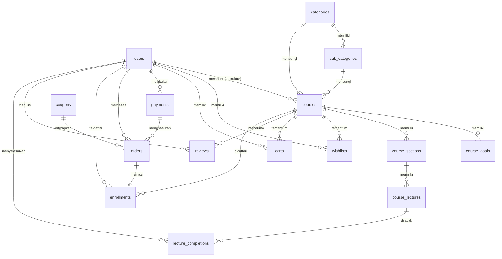

# 03 — Basis Data

## 3.1 Prinsip Rancangan

Skema database BelajarKUY dirancang dengan prinsip berikut:

1. **Normalisasi** hingga bentuk normal ketiga, kecuali denormalisasi strategis yang didokumentasikan dengan alasan jelas.
2. **Index** pada kolom yang sering menjadi kriteria pencarian, seperti foreign key, slug, dan kolom status.
3. **Menghindari redundansi berbahaya**, yaitu tidak menyimpan data turunan yang dapat menjadi usang.
4. **Price snapshot** pada transaksi, agar catatan pesanan tetap sahih meskipun harga kursus berubah di kemudian hari.

## 3.2 Pengelompokan Tabel

### Identitas dan katalog

- `users` — data pengguna beserta peran (`user`, `instructor`, `admin`).
- `categories` dan `sub_categories` — klasifikasi kursus.
- `courses` — data kursus, termasuk harga, diskon, status moderasi, serta penanda unggulan dan terlaris.
- `course_goals` — sasaran belajar yang akan dicapai siswa.
- `course_sections` dan `course_lectures` — kurikulum berjenjang: bagian yang memuat materi.

### Commerce

- `wishlists` — wishlist siswa.
- `carts` — cart belanja. Tidak menyimpan harga maupun instruktur karena keduanya dihitung langsung dari kursus.
- `coupons` — kupon diskon milik instruktur, dapat berlaku global atau khusus satu kursus, dengan batas pemakaian.
- `payments` — catatan pembayaran beserta status dari payment gateway.
- `orders` — pesanan yang menyimpan price snapshot (harga asli, potongan, harga akhir) dan instruktur secara denormalisasi untuk pelaporan.
- `enrollments` — pendaftaran kelas yang menjadi acuan tunggal hak akses sebuah kursus, sekaligus menyimpan data sertifikat.
- `lecture_completions` — catatan penyelesaian materi per siswa, sebagai dasar penghitungan progres.

### Konten, ulasan, dan layanan

- `reviews` — ulasan dan rating kursus, lengkap dengan status moderasi dan pelaporan.
- `sliders`, `info_boxes`, `partners` — elemen konten halaman depan.
- `site_infos` — pengaturan situs dalam bentuk pasangan key-value.
- `course_reports` — laporan terhadap kursus yang diajukan pengguna.
- `support_tickets`, `support_ticket_messages`, `support_ticket_attachments` — help desk berbentuk percakapan beserta lampiran.
- `contact_messages` — pesan dari formulir kontak.
- `email_otps` — kode sekali pakai untuk verifikasi email.
- `notifications` — notifikasi pengguna.

## 3.3 Diagram Relasi Entitas

## 3.4 Aturan Integritas Penting

- **Unique pair** pada `carts`, `wishlists`, `enrollments`, dan `reviews` melalui unique constraint `(user_id, course_id)`. Satu siswa tidak dapat menggandakan kursus yang sama pada cart, wishlist, enrollment, maupun ulasan.
- **Unique completion** pada `lecture_completions` melalui unique constraint `(user_id, lecture_id)`.
- **Acuan hak akses** sebuah kursus selalu ditentukan oleh keberadaan baris pada `enrollments`, bukan dari `orders` maupun `payments`. Pemisahan ini membuat pengecekan akses menjadi satu query sederhana.
- **Price snapshot** disimpan pada `orders`. Harga kursus dapat berubah, tetapi pesanan tetap mencatat nilai pada saat transaksi terjadi.
- **Cascade delete** pada relasi induk diteruskan ke tabel anak melalui aturan foreign key yang sesuai, sehingga tidak ada baris yatim.

## 3.5 Strategi Index

Selain index bawaan pada primary key dan foreign key, ditetapkan composite index pada kombinasi kolom yang sering dipakai bersama, antara lain:

- `(status, featured)` dan `(status, bestseller)` pada `courses` untuk query halaman depan.
- `(instructor_id, status)` pada `courses` untuk dashboard instruktur.
- `(user_id, status)` pada `orders` dan `payments` untuk riwayat dan pelaporan.

## 3.6 Status sebagai State Machine

Beberapa kolom status berperan sebagai state machine yang mengendalikan alur:

- **Status kursus**: `draft` menuju `pending_review`, lalu `active` atau `inactive` setelah moderasi.
- **Status pembayaran**: `pending` menuju salah satu hasil akhir dari payment gateway, seperti `settlement` atau `capture` untuk keberhasilan, serta `cancel`, `expire`, atau `failure` untuk kegagalan.
- **Status pesanan**: `pending` menuju `completed`, `cancelled`, atau `refunded`.
